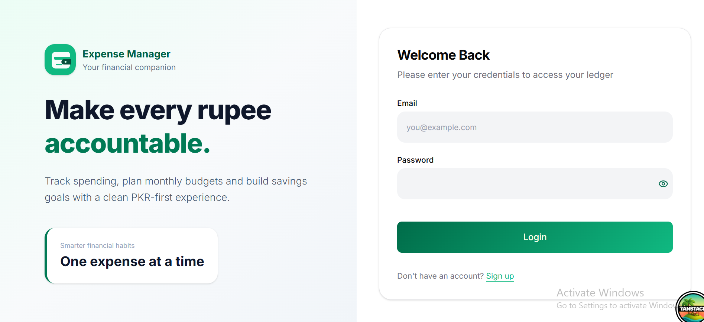
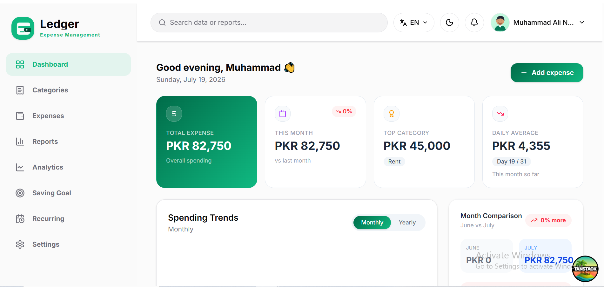
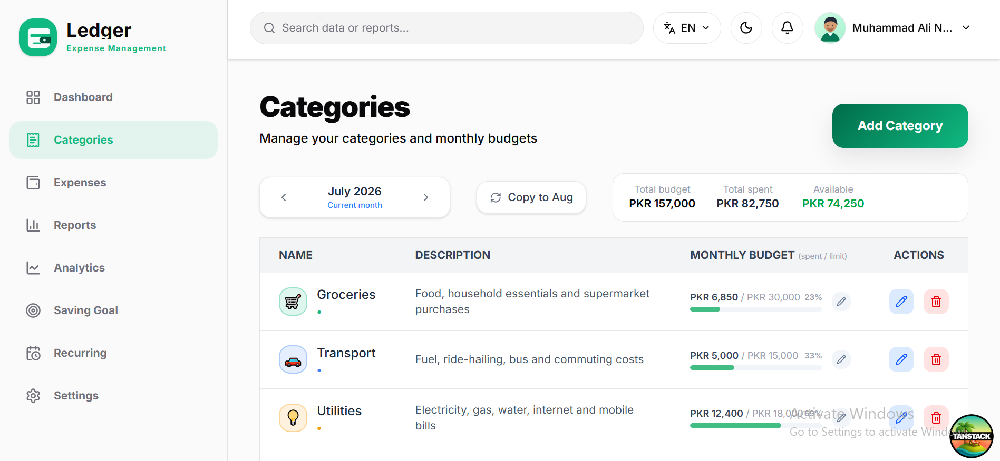
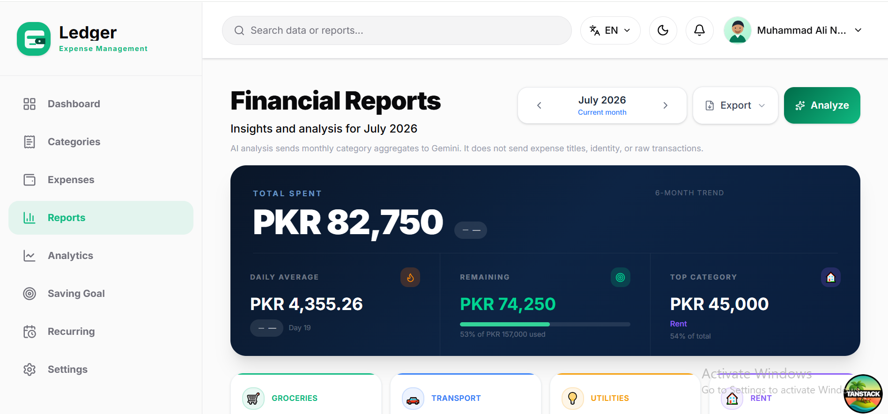
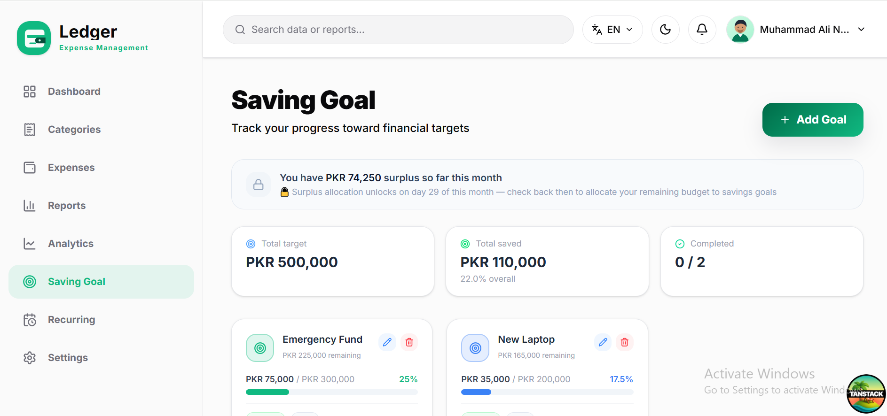
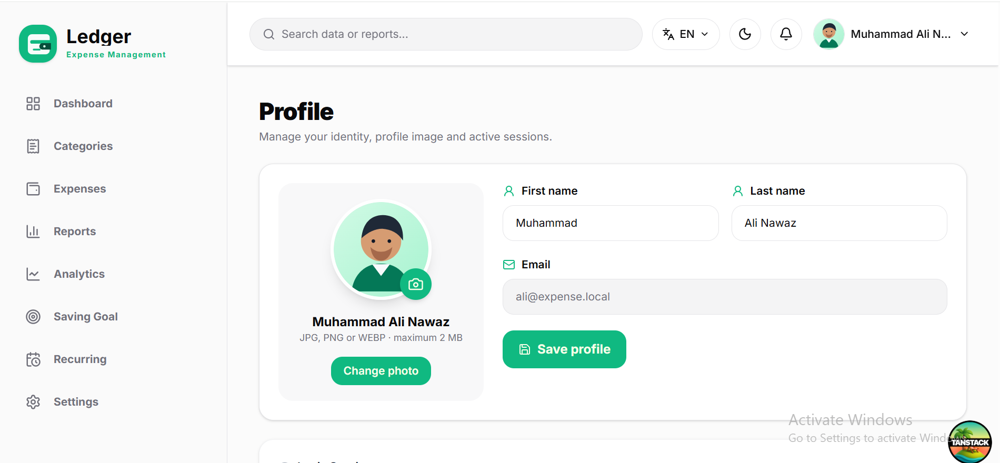

<h1 align="center">💰 Expense Management System</h1>

<p align="center">
  <b>A secure, responsive, portfolio-ready personal finance platform built with ASP.NET Core 8 Web API, React 19, TypeScript, SQL Server, Entity Framework Core, JWT authentication, Tailwind CSS, SignalR, and Recharts.</b>
</p>

<p align="center">
  
  
  
  
  
  
  
  
</p>

---

## 📸 Project Screenshots

| Responsive Sign In | Dashboard |
|---|---|
|  |  |

| Categories and Budgets | Reports and Visualizations |
|---|---|
|  |  |

| Savings Goals | Profile Management |
|---|---|
|  |  |

---

## 🚀 Project Overview

**Expense Management System** is a full-stack personal finance application designed to demonstrate practical ASP.NET Core and React development in a secure, maintainable, and responsive solution.

Users can register, confirm their email address, sign in securely, organize expenses by category, define monthly budgets, monitor savings goals, automate recurring expenses, inspect spending analytics, export financial reports, manage their profile image, and receive real-time notifications.

The backend is an **ASP.NET Core 8 REST API** backed by SQL Server and Entity Framework Core. The frontend is a standalone **React 19 + TypeScript + Vite** application using Tailwind CSS, TanStack Query, TanStack Router, Recharts, Axios, and SignalR.


---

## 🎯 Project Purpose


- ASP.NET Core 8 Web API development
- React 19 and TypeScript frontend architecture
- SQL Server and Entity Framework Core migrations
- ASP.NET Core Identity with confirmed-email login
- JWT access tokens and rotating refresh tokens
- Server-side ownership validation
- Category budgets and personal expense workflows
- SQL-backed starter data
- Interactive financial charts and reporting
- PDF and Excel export generation
- SignalR real-time notifications
- Background processing for recurring expenses
- Responsive mobile, tablet, laptop, and desktop layouts
- Persistent light and dark themes
- English and Arabic localization
- Automated unit, authorization, validation, and repository tests
- Secret-safe local configuration through .NET User Secrets and environment files

---

## ⭐ Key Highlights

- Secure registration and confirmed-email authentication
- ASP.NET Core Identity password hashing and lockout protection
- JWT access tokens with issuer, audience, signature, lifetime, and security-stamp validation
- Rotating database-backed refresh tokens stored in secure HTTP-only cookies
- Access tokens kept in frontend memory rather than browser persistent storage
- Per-user categories, expenses, budgets, savings goals, and recurring expenses
- SQL Server starter-data procedure that avoids duplicate records
- PKR currency formatting throughout the user interface and exports
- Dashboard summaries, recent activity, category rankings, and budget alerts
- Daily, cumulative, category-distribution, and budget-versus-actual charts
- PDF reports generated with QuestPDF
- Excel reports generated with ClosedXML
- Real-time SignalR notifications with automatic reconnection
- Profile name editing and validated JPG, PNG, or WEBP avatar uploads
- Default neutral male vector avatar
- Login-session history with browser, operating system, device, IP, and activity details
- Fixed desktop sidebar and responsive mobile off-canvas navigation
- Persistent dark/light appearance and dashboard-display preferences
- English and Arabic interface support
- Swagger/OpenAPI documentation in Development
- Serilog console and rolling JSON-file logging
- 21 passing xUnit tests

---

## ✨ Features

### 🔐 Authentication and Account Management

| Feature | Description |
|---|---|
| Registration | Creates an ASP.NET Core Identity account with first name, last name, email, and a strong password |
| Email confirmation | Requires a confirmed email before login |
| Secure login | Issues a 30-minute JWT access token and a rotating refresh token |
| Session refresh | Restores authenticated sessions through a secure HTTP-only refresh-token cookie |
| Lockout protection | Locks an account for 15 minutes after five failed login attempts |
| Logout | Revokes active refresh tokens and clears the authentication cookie |
| Profile editing | Updates first and last name |
| Avatar management | Uploads or removes validated profile images up to 2 MB |
| Session history | Shows recent browser, OS, device, IP, login, and activity information |

### 💳 Expense and Budget Management

| Feature | Description |
|---|---|
| Categories | Creates, edits, colors, icons, and soft-deletes user-owned categories |
| Expenses | Creates, updates, lists, filters, and deletes personal expense records |
| Category budgets | Assigns monthly PKR budgets to individual categories |
| Budget summary | Compares monthly limits, actual spending, remaining amounts, and utilization |
| Dashboard | Displays SQL-backed totals, trends, alerts, recent expenses, and top categories |
| Empty states | Hides low-value empty sections by default and provides actionable onboarding states |

### 🎯 Savings and Automation

| Feature | Description |
|---|---|
| Savings goals | Creates targets and records saved amounts |
| Surplus allocation | Allocates available category surplus toward savings goals |
| Recurring expenses | Configures repeating expenses and active/inactive status |
| Background service | Processes eligible recurring expenses automatically |

### 📊 Analytics and Reports

| Feature | Description |
|---|---|
| Daily spending | Line chart of actual spending by day |
| Cumulative spending | Running monthly expense trend |
| Category distribution | Donut chart generated from SQL expense records |
| Budget comparison | Horizontal bar chart comparing category budgets and actual spending |
| Reports | Monthly totals, category performance, burn rate, and financial summaries |
| PDF export | Generates downloadable reports with QuestPDF |
| Excel export | Generates spreadsheet reports with ClosedXML |
| Optional AI analysis | Uses Gemini when an API key is configured and applies a per-user rate limit |

### 📱 Responsive User Experience

- Responsive mobile, tablet, laptop, and desktop layouts
- Fixed desktop sidebar with independently scrollable navigation
- Mobile off-canvas sidebar with backdrop, Escape-key support, and body-scroll locking
- Persistent light/dark mode based on saved or operating-system preference
- Working Settings page for appearance, language, and dashboard empty-section preferences
- English and Arabic localization with RTL-aware layout behavior
- Toast feedback, loading states, form validation, and error handling
- Relevant application branding and favicon

---

## 🛠 Technology Stack

### ⚙️ Backend

| Area | Technology |
|---|---|
| Runtime | .NET 8 |
| Language | C# |
| Framework | ASP.NET Core 8 Web API |
| Authentication | ASP.NET Core Identity + JWT Bearer |
| Authorization | Authenticated endpoints, roles, security-stamp checks, and per-user ownership validation |
| ORM | Entity Framework Core 8.0.21 |
| Database | Microsoft SQL Server |
| Real-time communication | ASP.NET Core SignalR |
| API documentation | Swagger / OpenAPI |
| Mapping | AutoMapper 15.0.1 |
| PDF export | QuestPDF 2026.2.4 |
| Excel export | ClosedXML 0.105.0 |
| Logging | Serilog.AspNetCore 8.0.3 |
| Testing | xUnit 2.9.2, Moq 4.20.72, EF Core InMemory |
| EF CLI | Repository-local `dotnet-ef` 8.0.21 |

### 🎨 Frontend

| Area | Technology |
|---|---|
| UI library | React 19.2.3 |
| Language | TypeScript 5.9.3 |
| Build tool | Vite 7.3.6 |
| Styling | Tailwind CSS 4.1.18 |
| Routing | TanStack Router 1.143.11 |
| Server state | TanStack Query 5.99.2 |
| HTTP client | Axios 1.18.1 |
| Charts | Recharts 3.6.0 |
| Real-time client | Microsoft SignalR 10.0.0 |
| Forms | React Hook Form 7.72.1 |
| Localization | i18next 26.0.6 + react-i18next 17.0.4 |
| Icons | Lucide React 0.562.0 |
| Notifications | React Hot Toast 2.6.0 |
| Testing | Vitest 3.2.7 + Testing Library |

---

## 🏗 Architecture Overview

```text
Browser
   |
   v
React 19 + TypeScript + TanStack Router
   |
   +--> TanStack Query / Axios ------ HTTPS REST API
   |
   +--> SignalR Client -------------- Notification Hub
                                      |
                                      v
                             ASP.NET Core 8 Web API
                                      |
                         Authentication / Authorization
                                      |
                         Controllers and DTO Validation
                                      |
                         Repository Interfaces and Logic
                                      |
                         Entity Framework Core 8
                                      |
                                      v
                              Microsoft SQL Server
```

### Layer Responsibilities

| Project | Responsibility |
|---|---|
| `ExpenseManagement.API/ExpenseManagement.API` | REST controllers, Identity/JWT security, repositories, EF Core context and migrations, SignalR hub, exports, localization, logging, and hosted services |
| `ExpenseManagement.API/ExpenseManagement.API.Tests` | DTO validation, controller security, ownership, recurring-expense, and repository regression tests |
| `expensemanagement.web` | React application, routes, API clients, authentication state, charts, settings, themes, localization, forms, and responsive layouts |
| `docs/screenshots` | Portfolio screenshots used by this README |

### Authentication Flow

```text
User submits email and password
              |
              v
ASP.NET Core Identity validates password, lockout, and confirmed email
              |
              v
Previous active refresh tokens are revoked
              |
              v
API issues a short-lived JWT and rotating refresh token
              |
              +--> JWT is held in frontend memory
              |
              +--> Refresh token is stored in a Secure, HttpOnly cookie
              |
              v
Security stamp and token claims are validated on protected requests
```

### Financial Data Flow

```text
React page requests dashboard, expense, category, budget, or savings data
              |
              v
Axios sends the JWT and current Accept-Language header
              |
              v
Authorized API controller resolves the authenticated user ID
              |
              v
Repository queries or updates only that user's SQL records
              |
              v
DTO response is rendered as cards, tables, charts, or exports
```

---

## 🔐 Security and Reliability

| Area | Implementation |
|---|---|
| Password storage | ASP.NET Core Identity password hashing |
| Password policy | Minimum 8 characters with uppercase, lowercase, number, and symbol |
| Confirmed email | Login is rejected until the Identity email-confirmation flag is set |
| Login lockout | Five failed attempts trigger a 15-minute lockout |
| Access token | Signed JWT with issuer, audience, lifetime, signing-key, and security-stamp validation |
| Access-token lifetime | 30 minutes with one-minute clock skew |
| Refresh token | Cryptographically generated, database-backed, two-day token with rotation and revocation |
| Refresh cookie | HTTP-only, Secure, SameSite=None, and scoped to account endpoints |
| Frontend token storage | Access token remains in memory and is not persisted to localStorage or sessionStorage |
| Ownership protection | Repositories and controllers scope financial records to the authenticated user |
| CORS | Explicit frontend origins with credentials enabled |
| AI rate limiting | Five analysis requests per user/IP per minute |
| Avatar validation | JPG, PNG, or WEBP only; maximum 2 MB; server-generated file names |
| Error handling | Centralized problem handling and safe API responses |
| Logging | Structured Serilog console and rolling JSON logs |
| Secrets | Connection strings, JWT signing keys, SMTP credentials, and AI keys remain outside Git |
| Testing | 21 automated regression tests |


---

## 🗃 Database Model

### Identity and Session Schema

ASP.NET Core Identity and application authentication use:

- `AspNetUsers`
- `AspNetRoles`
- `AspNetUserRoles`
- `AspNetUserClaims`
- `AspNetUserLogins`
- `AspNetUserTokens`
- `RefreshTokens`
- `UserSessions`

### Application Tables

| Table | Purpose |
|---|---|
| `Categories` | User-owned category definitions, icons, colors, and soft-delete state |
| `Expenses` | Individual dated expense records linked to users and categories |
| `CategoryBudgets` | Monthly budget limits by category |
| `SavingsGoals` | Savings targets and recorded progress |
| `RecurringExpenses` | Scheduled repeating expenses and next-run information |
| `SurplusAllocations` | Transfers of category surplus toward savings goals |
| `__EFMigrationsHistory` | Applied Entity Framework Core migration records |

### SQL-backed Starter Data

The migration `20260719123000_AddSqlStarterDataProcedure` creates:

```text
dbo.SeedExpenseManagementStarterData
```

On the first successful login, the backend calls this stored procedure. It returns immediately when the user already has active categories, making the operation idempotent and preventing duplicate starter records.

The seed procedure creates general personal-finance categories, category budgets, current and historical expenses, savings goals, and recurring expenses directly in SQL Server.

### Included Migrations

```text
20251121032641_initMigaration
20260421063758_addAmountToCategory
20260425135046_AddSavingsGoals
20260426023649_AddCategoryBudgets
20260427055757_AddRecurringExpenses
20260428054607_AddIconAndColorToCategory
20260428093607_AddSurplusAllocation
20260429043905_AddUserSessions
20260719090000_AddProfileImageUrl
20260719123000_AddSqlStarterDataProcedure
```

---

## 📁 Repository Structure

```text
expense-management-system-dotnet-react/
├── docs/
│   └── screenshots/
│       ├── categories.png
│       ├── dashboard.png
│       ├── profile.png
│       ├── reports.png
│       ├── savings.png
│       └── signin.png
├── ExpenseManagement/
│   ├── ExpenseManagement.API/
│   │   ├── .config/
│   │   │   └── dotnet-tools.json
│   │   ├── ExpenseManagement.API/
│   │   │   ├── Configuration/
│   │   │   ├── Contracts/
│   │   │   ├── Controllers/
│   │   │   ├── Data/
│   │   │   ├── DTOs/
│   │   │   ├── Helper/
│   │   │   ├── Hubs/
│   │   │   ├── Migrations/
│   │   │   ├── Models/
│   │   │   ├── Repositories/
│   │   │   ├── Resources/
│   │   │   ├── Services/
│   │   │   ├── Templates/
│   │   │   ├── wwwroot/
│   │   │   ├── appsettings.json
│   │   │   ├── ExpenseManagement.API.csproj
│   │   │   └── Program.cs
│   │   ├── ExpenseManagement.API.Tests/
│   │   └── ExpenseManagement.API.sln
│   └── expensemanagement.web/
│       ├── public/
│       ├── src/
│       │   ├── api/
│       │   ├── components/
│       │   ├── context/
│       │   ├── hooks/
│       │   ├── lib/
│       │   ├── routes/
│       │   ├── service/
│       │   └── Types/
│       ├── .env.example
│       ├── package.json
│       ├── package-lock.json
│       ├── tsconfig.json
│       └── vite.config.ts
├── .gitignore
├── LICENSE
└── README.md
```

---

## ⚙️ Installation Guide — Windows PowerShell

### Requirements

- Windows 10 or Windows 11
- PowerShell 5.1 or PowerShell 7+
- .NET 8 SDK x64
- Node.js 20 LTS or Node.js 22+
- npm
- Microsoft SQL Server
- Git
- Optional: `sqlcmd` for direct database verification

Verify the tools:

```powershell
dotnet --list-sdks
dotnet --list-runtimes
node --version
npm --version
git --version
Get-Command sqlcmd -ErrorAction SilentlyContinue
```

The active x64 .NET installation must include both `Microsoft.NETCore.App 8.0.x` and `Microsoft.AspNetCore.App 8.0.x`.

### 1. Clone the Repository

```powershell
git clone https://github.com/YOUR_GITHUB_USERNAME/expense-management-system-dotnet-react.git
Set-Location '.\expense-management-system-dotnet-react'

$RepoRoot = (Get-Location).Path
$SolutionRoot = Join-Path $RepoRoot 'ExpenseManagement'
$ApiSolution = Join-Path $SolutionRoot 'ExpenseManagement.API'
$ApiProject = Join-Path $ApiSolution 'ExpenseManagement.API'
$Frontend = Join-Path $SolutionRoot 'expensemanagement.web'
```

### 2. Verify SQL Server

Default SQL Server instance:

```powershell
$SqlServer = $env:COMPUTERNAME
Get-Service -Name 'MSSQLSERVER'
```

SQL Server Express:

```powershell
$SqlServer = "$env:COMPUTERNAME\SQLEXPRESS"
```

Create the local connection string:

```powershell
$DatabaseName = 'ExpenseManagement'
$ConnectionString = "Server=$SqlServer;Database=$DatabaseName;Trusted_Connection=True;MultipleActiveResultSets=True;TrustServerCertificate=True"
```

`Trusted_Connection=True` uses the currently signed-in Windows account. That account must have permission to create or access the database.

### 3. Select .NET 8 and Restore Backend Packages

```powershell
$Dotnet = (Get-Command dotnet).Source

Set-Location $ApiSolution

dotnet restore '.\ExpenseManagement.API.sln'
dotnet tool restore
dotnet ef --version
```

Expected repository-local EF CLI version:

```text
8.0.21
```

When your current Windows user uses a private `.dotnet` installation:

```powershell
$Dotnet = "$env:USERPROFILE\.dotnet\dotnet.exe"
$env:DOTNET_ROOT = "$env:USERPROFILE\.dotnet"
$env:Path = "$env:USERPROFILE\.dotnet;$env:USERPROFILE\.dotnet\tools;$env:Path"
```

Then replace `dotnet` in the following backend commands with `& $Dotnet`.

### 4. Configure .NET User Secrets

```powershell
Set-Location $ApiProject

if (-not (Select-String -Path '.\ExpenseManagement.API.csproj' -Pattern '<UserSecretsId>' -Quiet)) {
    dotnet user-secrets init
}

dotnet user-secrets set 'ConnectionStrings:defaultConnection' "$ConnectionString"
dotnet user-secrets set 'Jwt:Issuer' 'ExpenseManagement.API'
dotnet user-secrets set 'Jwt:Audience' 'ExpenseManagement.Web'
dotnet user-secrets set 'FrontendBaseUrl' 'http://localhost:3000'
```

Generate and store a cryptographically random JWT signing key:

```powershell
$JwtBytes = New-Object byte[] 64
$RandomGenerator = [System.Security.Cryptography.RandomNumberGenerator]::Create()
$RandomGenerator.GetBytes($JwtBytes)
$RandomGenerator.Dispose()
$JwtKey = [Convert]::ToBase64String($JwtBytes)

dotnet user-secrets set 'Jwt:Key' "$JwtKey"

Remove-Variable JwtBytes, RandomGenerator, JwtKey
```

Review configured key names without publishing values:

```powershell
dotnet user-secrets list |
    ForEach-Object { ($_ -split '\s*=\s*', 2)[0] }
```

### 5. Optional SMTP Configuration

SMTP is required only for sending real confirmation-email links:

```powershell
dotnet user-secrets set 'Smtp:Host' 'smtp.gmail.com'
dotnet user-secrets set 'Smtp:Port' '587'
dotnet user-secrets set 'Smtp:EnableSsl' 'true'
dotnet user-secrets set 'Smtp:Username' 'YOUR_EMAIL_ADDRESS'
dotnet user-secrets set 'Smtp:FromEmail' 'YOUR_EMAIL_ADDRESS'
dotnet user-secrets set 'Smtp:Password' 'YOUR_PROVIDER_APP_PASSWORD'
```

Use an application-specific password where required. Never commit SMTP credentials.

### 6. Optional Gemini Configuration

The regular dashboard and local analytics do not require Gemini. Configure it only for optional AI report analysis:

```powershell
dotnet user-secrets set 'Gemini:ApiKey' 'YOUR_GEMINI_API_KEY'
```

### 7. Trust HTTPS and Apply Migrations

```powershell
dotnet dev-certs https --trust

Set-Location $ApiSolution
$env:ASPNETCORE_ENVIRONMENT = 'Development'

dotnet ef database update `
    --project '.\ExpenseManagement.API\ExpenseManagement.API.csproj' `
    --startup-project '.\ExpenseManagement.API\ExpenseManagement.API.csproj'
```

Do not create a new initial migration. The repository already contains the complete migration history.

### 8. Build and Test the Backend

```powershell
dotnet build '.\ExpenseManagement.API.sln' --configuration Debug

dotnet test '.\ExpenseManagement.API.sln' `
    --configuration Debug `
    --no-build
```

Verified test result:

```text
Failed: 0
Passed: 21
Skipped: 0
Total: 21
```

### 9. Configure and Install the Frontend

```powershell
Set-Location $Frontend

Copy-Item '.\.env.example' '.\.env.local' -Force
Get-Content '.\.env.local'
```

Expected values:

```text
VITE_API_BASE_URL=https://localhost:7210/api
VITE_SIGNALR_HUB_URL=https://localhost:7210/notificationHub
```

Install the exact lockfile dependencies:

```powershell
npm config set registry 'https://registry.npmjs.org/'

npm ci `
    --registry='https://registry.npmjs.org/' `
    --no-audit `
    --no-fund
```

Build and test:

```powershell
npm test
npm run build
```

### 10. Run the Backend

Open the first normal PowerShell window:

```powershell
Set-Location $ApiProject
$env:ASPNETCORE_ENVIRONMENT = 'Development'

dotnet run --launch-profile https
```

Local backend addresses:

```text
Swagger: https://localhost:7210/swagger
HTTPS:   https://localhost:7210
HTTP:    http://localhost:5273
```

### 11. Run the Frontend

Open a second normal PowerShell window:

```powershell
Set-Location $Frontend
npm run dev
```

Open:

```powershell
Start-Process 'http://localhost:3000'
```

Frontend address:

```text
http://localhost:3000
```

---

## 👥 Registration and Local Email Confirmation

The repository does not contain default usernames or passwords. Register your own local account through the web interface.

The password policy requires at least eight characters with uppercase, lowercase, number, and symbol characters.

With SMTP configured, use the confirmation link sent by the application. For local development only, when SMTP is intentionally unavailable, an existing registered email can be confirmed directly in the development database:

```powershell
$Email = 'YOUR_REGISTERED_EMAIL'

sqlcmd `
    -I `
    -S $SqlServer `
    -E `
    -d ExpenseManagement `
    -Q "SET ANSI_NULLS ON; SET QUOTED_IDENTIFIER ON; SET ANSI_PADDING ON; SET ANSI_WARNINGS ON; SET CONCAT_NULL_YIELDS_NULL ON; SET ARITHABORT ON; SET NUMERIC_ROUNDABORT OFF; UPDATE dbo.AspNetUsers SET EmailConfirmed = 1 WHERE Email = N'$Email'; SELECT Email, EmailConfirmed FROM dbo.AspNetUsers WHERE Email = N'$Email';"
```

---

## ▶️ Normal Daily Startup

### ⚙️ Backend terminal

```powershell
$Dotnet = "$env:USERPROFILE\.dotnet\dotnet.exe"
$env:DOTNET_ROOT = "$env:USERPROFILE\.dotnet"
$env:ASPNETCORE_ENVIRONMENT = 'Development'

Set-Location 'C:\path\to\expense-management-system-dotnet-react\ExpenseManagement\ExpenseManagement.API\ExpenseManagement.API'

& $Dotnet run --launch-profile https
```

When the standard `dotnet` installation already includes .NET 8 x64, use `dotnet run --launch-profile https` instead.

### 🎨 Frontend terminal

```powershell
Set-Location 'C:\path\to\expense-management-system-dotnet-react\ExpenseManagement\expensemanagement.web'

npm run dev
```

---

## 🧪 Testing

Run all backend tests:

```powershell
Set-Location $ApiSolution

dotnet test '.\ExpenseManagement.API.sln' `
    --configuration Debug
```

Run frontend tests:

```powershell
Set-Location $Frontend
npm test
```

The backend regression suite covers areas including:

- DTO validation
- Required authorization attributes
- Per-user repository ownership filtering
- User lookup and session behavior
- Recurring-expense processing
- Insights-controller authorization and failure handling
- Protected controller security configuration

Check dependency advisories and outdated backend packages:

```powershell
Set-Location $ApiSolution

dotnet list '.\ExpenseManagement.API.sln' package --vulnerable --include-transitive
dotnet list '.\ExpenseManagement.API.sln' package --outdated
```

Check frontend dependencies:

```powershell
Set-Location $Frontend
npm audit
npm outdated
```

---

## 🧾 Example Demo Workflow

1. Configure SQL Server, User Secrets, and the frontend environment file.
2. Apply the included EF Core migrations.
3. Start the API and React frontend.
4. Register and confirm a new account.
5. Sign in to trigger SQL-backed starter data for an empty account.
6. Review dashboard totals and budget alerts.
7. Create or edit categories and monthly budgets.
8. Add, filter, edit, and delete expenses.
9. Review Analytics charts for daily, cumulative, category, and budget trends.
10. Create a savings goal and allocate surplus.
11. Configure recurring expenses.
12. Export a PDF or Excel report.
13. Update the profile name and avatar.
14. Test light/dark mode, language, settings, and responsive navigation.
15. Run all automated tests.

---

## 🚀 Deployment Notes

Before deploying:

- Use a production SQL Server connection string from a secret manager.
- Use a long, randomly generated production JWT signing key.
- Configure explicit production CORS origins.
- Configure HTTPS end to end.
- Store SMTP and Gemini credentials outside source control.
- Use durable storage for uploaded avatars or move them to object storage.
- Review dependency advisories and licensing requirements.
- Disable Swagger outside approved environments.
- Back up the database before applying migrations.
- Review logging retention and avoid logging personal financial data.

---

## 👨‍💻 Author

**Muhammad Ali Nawaz**  
ASP.NET Core and React Developer

---

## 📄 License

This project is open-source software licensed under the [MIT License](LICENSE).

---

<p align="center">
  <b>⭐ If this project helps you, consider starring the repository!</b>
</p>
